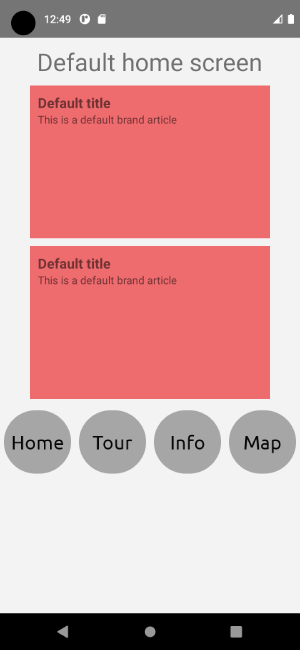
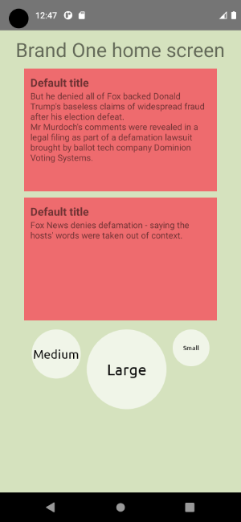
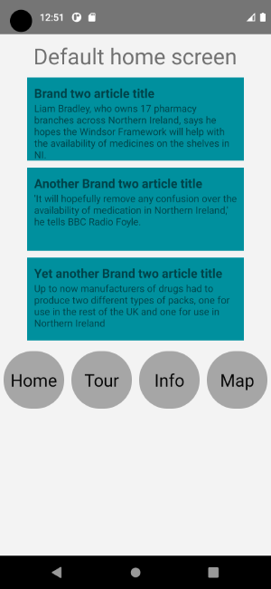

# What is it?

It's a simple React Native application, based on showcasing how a white label app could be implemented with React Native and Babel.

Have a look at [this blog post](https://medium.com/@jaroslaw.marek/white-label-mobile-app-with-react-native-and-babel-490363ec59) for a detailed explanation of how it works.

## Select which product brand you work on

In your scripts/load_env file, ensure the desired brand variables are uncommented.

Then run the following command to configure the given brand:

```
yarn configure-brand
```

Note: for Mac, it is necessary to have XCode installed and on the path prior to running `yarn configure-brand`.

Note: if you're not on Mac, you can use the `yarn configure-brand:android` instead.

# Building

You can build four different versions of this app. One for each "brand": `brand_one`, `brand_teo`, `brand_three`,and the default.

# Running

Ensure you start the Metro bundler manually (with `yarn start`) before running the app in Debug mode.
When Metro is started automatically via react-native scripts, it does not contain the required environmental variables.

`yarn android` or `yarn ios` will produce one of the following apps (depending on which ENVKEY is defined in the `.env` file).







## Switching between the brands

1. Stop the Metro bundler.
1. Uncomment the brand variables in scripts/load_env
1. Run `yarn configure-brand`.
1. Start the Metro bundler with `yarn start --reset-cache` (resetting the bundler cache is important here)
1. Start the app with `yarn android` or `yarn ios`

# More detailed docs

- Usage of the Whitelabelling mechanism: [docs/usage.md](docs/usage.md)
- Intricacies and mechanics of the Whitelabelling mechanism: [docs/mechanics.md](docs/mechanics.md)
- Known issues: [docs/known_issues.md](docs/known_issues.md)
